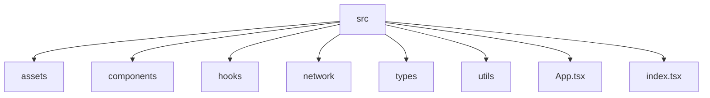

# 🚀 Real-Time Trading Dashboard

---

## 📌 Quick Overview
A **real-time trading dashboard** built with **React + TypeScript**, integrating both the **Binance REST API** and **Binance WebSocket Streams**.  
The dashboard displays **live ticker prices**, **multi-timeframe candlestick charts**, and allows users to switch between financial instruments seamlessly.

It combines:
- 📡 **REST API** → for fetching historical candlestick (kline) data  
- 🔌 **WebSockets** → for streaming live price & candle updates  
---

## 📑 Table of Contents
- [🚀 Quick Overview](#-quick-overview)  
- [✨ Features](#-features)  
- [🛠 Tech Stack](#-tech-stack)  
- [📂 Folder Structure](#-folder-structure)  
- [⚡ Getting Started](#-getting-started)
- [🌐 API & WebSocket Usage](#-api--websocket-usage)  
- [📚 References](#-references)  
- [🚧 Improvements & Roadmap](#-improvements--roadmap)  
- [🐞 Troubleshooting](#-troubleshooting)  
- [📄 License & Contact](#-license--contact)  

---

## ✨ Features
- 🟢 **Live Ticker Prices** – Real-time price updates from Binance WebSocket Streams.  
- 📊 **Multi-Timeframe Charts** – Candlestick charts with interval options (1m, 5m, 15m, 1h, 4h, 1d...).  
- 🔄 **Switch Tickers** – Change between symbols instantly.  
- ⏳ **Historical Data Fetching** – Using Binance REST `/klines` API.  
- 🌐 **Real-Time WebSocket Data** – Live candlestick & price updates.  
- ⚡ **Responsive Design** – Fully responsive UI.  

**Addditional Features:**  
- 🔔 Price alerts for specific thresholds.  
- 📊 Candlestick charts with selectable intervals (1m, 5m, 15m, 1h, 1d, etc.).

---

## 🛠 Tech Stack
- **Frontend:** React, TypeScript, Chart.js, chartjs-chart-financial
- **State Management:** React Hooks (useState, useEffect)  
- **API:** Binance REST API (historical candlesticks)  
- **WebSocket:** Binance WebSocket Streams (real-time updates)  
- **Styling:** MUI

---

## 📂 Folder Structure

```plaintext
src/
├── assets/           # Images, icons, screenshots
├── components/       # UI components (TickerList, Chart, etc.)
├── hooks/            # Custom hooks (WebSocket, API)
├── config/          # theming
├── types.ts            # TypeScript types and interfaces
├── util.ts            # Helper functions (formatting, timestamps)
├── App.tsx           # Main app entry
└── constants.ts        # constants
└── main.tsx         # ReactDOM render
````

**Folder Structure Diagram:**



---

## ⚡ Getting Started

### Prerequisites

* Node.js >= 18
* npm

### Installation

```bash
git clone https://github.com/yourusername/live-trades-dashboard.git
cd live-trades-dashboard
npm install
```

### Run Development Server

```bash
npm run dev
# App will run at http://localhost:3000
```

Open [http://localhost:3000](http://localhost:3000) in your browser.

---


## 🌐 API & WebSocket Usage

🔹 Binance REST API (Historical Data)

Used for fetching historical candlestick (kline) data:

GET /api/v3/klines?symbol=BTCUSDT&interval=5m&startTime=1764806602940&limit=1000

🔹 Binance WebSocket Streams (Live Updates)

Real-time candlestick streaming:

wss://stream.binance.com:9443/stream?streams=btcusdt@kline_5m

🔹 Combined Streams (Multiple Tickers)

Subscribe to multiple tickers in a single WebSocket connection:

wss://stream.binance.com:9443/stream?streams=
btcusdt@ticker/
ethusdt@ticker/
bnbusdt@ticker/
xrpusdt@ticker/
adausdt@ticker/
solusdt@ticker/
dogeusdt@ticker/
avaxusdt@ticker/
dotusdt@ticker/
ltcusdt@ticker/
trxusdt@ticker/
linkusdt@ticker/
atomusdt@ticker/
etcusdt@ticker

---


## 📚 References

REST API Docs (Klines):
https://developers.binance.com/docs/binance-spot-api-docs/rest-api/market-data-endpoints#klinecandlestick-data

WebSocket Streams:
https://developers.binance.com/docs/binance-spot-api-docs/web-socket-streams

Official Kline/Candlestick Stream Docs:
https://binance-docs.github.io/apidocs/spot/en/#kline-candlestick-streams

chartjs-chart-financial: https://www.chartjs.org/chartjs-chart-financial/

---

🔹 Extra Resources
---

## 🚧 Improvements & Roadmap

* Add **user authentication** for saved preferences.
* Add **dark mode / theme switcher**.
* Enhance **WebSocket reconnection logic** for robustness.
* Optimize **performance for large datasets** and multiple tickers.

---

## 🐞 Troubleshooting

* **WebSocket fails to connect:** 
Open Developer Tools.
Go to the Network tab and filter by WS.
Observe the handshake, data frames, and any errors.
Here the WebSocket handshake with Binance is confirmed by the 101 Switching Protocols status, allowing seamless live trade data streaming.

* **Chart not updating:** Ensure historical data is loaded before subscribing to WebSocket.

---

## 📄 License & Contact

* **License:** MIT License
* **Author:** Sukhitha Sunil
* **GitHub:** [[https://github.com/SukhithaSunil](https://github.com/SukhithaSunil)]

---
