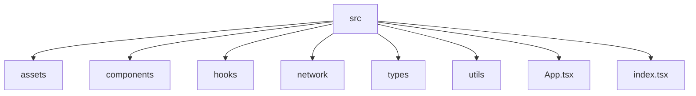

# 🚀 Real-Time Trading Dashboard

---

## 📌 Quick Overview
A **real-time trading dashboard** built with **React + TypeScript**.  
Monitor live ticker prices, view multi-timeframe candlestick charts, and switch between multiple financial instruments seamlessly.

---

## 📑 Table of Contents
- [🚀 Quick Overview](#-quick-overview)  
- [✨ Features](#-features)  
- [🛠 Tech Stack](#-tech-stack)  
- [📂 Folder Structure](#-folder-structure)  
- [⚡ Getting Started](#-getting-started)  
- [🚧 Improvements & Roadmap](#-improvements--roadmap)  
- [🐞 Troubleshooting](#-troubleshooting)  
- [📄 License & Contact](#-license--contact)  

---

## ✨ Features
- 🟢 **Live Ticker Prices** – Real-time price updates for multiple symbols.  
- 📊 **Interactive Charts** – Candlestick charts using Chart.js. 
- 🔄 **Switch Tickers** – Seamlessly switch between financial instruments.  
- ⏳ **Historical Data** – Fetch past candle data for charting.  
- 🌐 **WebSocket Integration** – Real-time data streaming for live updates.  
- ⚡ **Responsive Design** – Works on desktop and mobile.  

**Addditional Features:**  
- 🔔 Price alerts for specific thresholds.  
- 📊 Candlestick charts with selectable intervals (1m, 5m, 15m, 1h, 1d, etc.).

---

## 🛠 Tech Stack
- **Frontend:** React, TypeScript, Chart.js 
- **State Management:** React Hooks (useState, useEffect)  
- **API:** Binance REST API (historical candlesticks)  
- **WebSocket:** Binance WebSocket Streams (real-time updates)  
- **Styling:** MUI

---

## 📂 Folder Structure

```plaintext
src/
├── assets/           # Images, icons, screenshots
├── components/       # UI components (TickerList, Chart, etc.)
├── hooks/            # Custom hooks (WebSocket, API)
├── config/          # theming
├── types.ts            # TypeScript types and interfaces
├── util.ts            # Helper functions (formatting, timestamps)
├── App.tsx           # Main app entry
└── constants.tsx         # constants
└── main.tsx         # ReactDOM render
````

**Folder Structure Diagram:**



---

## ⚡ Getting Started

### Prerequisites

* Node.js >= 18
* npm

### Installation

```bash
git clone https://github.com/yourusername/live-trades-dashboard.git
cd live-trades-dashboard
npm install
```

### Run Development Server

```bash
npm run dev
# App will run at http://localhost:3000
```

Open [http://localhost:3000](http://localhost:3000) in your browser.

---

## 🚧 Improvements & Roadmap

* Add **user authentication** for saved preferences.
* Add **dark mode / theme switcher**.
* Enhance **WebSocket reconnection logic** for robustness.
* Optimize **performance for large datasets** and multiple tickers.

---

## 🐞 Troubleshooting

* **WebSocket fails to connect:** Check if Binance WS URL is correct and network allows WebSocket connections.
* **Chart not updating:** Ensure historical data is loaded before subscribing to WebSocket.

---

## 📄 License & Contact

* **License:** MIT License
* **Author:** Sukhitha Sunil
* **GitHub:** [[https://github.com/SukhithaSunil](https://github.com/SukhithaSunil)]

---
